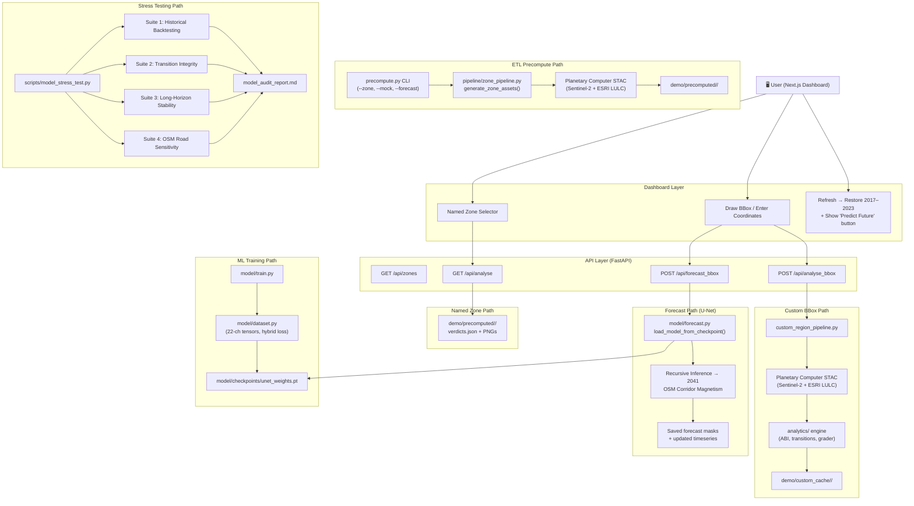

# Architecture Design — FarmGuard

This document details the system architecture, directory topology, and data flow of the FarmGuard/UrbanGenesis Farmland Encroachment Detection System.

---

## System Overview

FarmGuard is a decoupled, modular full-stack platform consisting of four distinct layers:

1. **Planetary Computer ETL Pipeline** (`pipeline/`): An ingestion engine that queries Sentinel-2 Level-2A imagery and ESRI Land Use / Land Cover (LULC) maps from Microsoft Planetary Computer via the STAC API.
2. **FastAPI Backend Services** (`api/`): A Python-based REST API that runs spatial analytics, serves region configuration, manages timeseries records, caches dynamic heatmaps, and triggers on-demand U-Net forecasting.
3. **Shared Core** (`core/`): A dependency-free kernel of class definitions, configuration loaders, and image utilities shared between the API and pipeline layers.
4. **Next.js 16 Dashboard** (`dashboard/`): An interactive, premium web client with React Leaflet map projections (ESRI Hybrid Satellite layer + Nominatim geocoding), comparative split-sliders, bbox drawing, manual coordinate entry, and data visualization timelines.

---

## System Flowchart



---

## Directory Topology

```
UrbanGenesis/
│
├── core/                          # Shared constants and utilities (no internal deps)
│   ├── class_map.py               # CLASS_INFO, CLASS_RGB, CLASS_COLORS, ESRI_TO_FARMGUARD
│   ├── config.py                  # load_config(), PRECOMPUTED_DIR, safe_float()
│   ├── image_utils.py             # rgb_to_mask(), mask_to_rgb()
│   └── bbox_utils.py              # validate_bbox(), bbox_cache_key()
│
├── api/                           # FastAPI HTTP layer
│   ├── main.py                    # create_app() — CORS, middleware, static mount, routers
│   ├── dependencies.py            # load_zone_verdict() (LRU-cached), get_zones_config()
│   └── routes/
│       ├── zones.py               # GET /api/zones (supports format=object query)
│       └── analyse.py             # GET /api/analyse
│                                  # POST /api/analyse_bbox
│                                  # POST /api/forecast_bbox
│                                  # DELETE /api/analyse_bbox/{cache_key}
│                                  # GET /static_custom/{cache_key}/{filename}
│
├── pipeline/                      # ETL / data acquisition layer
│   ├── stac_client.py             # create_stac_client() — authenticated STAC client factory
│   ├── landcover_fetcher.py       # fetch_esri_landcover_tile()
│   ├── sentinel_fetcher.py        # fetch_sentinel2_true_color()
│   ├── ndvi.py                    # generate_ndvi_map_from_bands()
│   ├── mock_generator.py          # generate_realistic_mock(), mask_to_true_color()
│   ├── zone_pipeline.py           # generate_zone_assets() — full orchestrator
│   └── custom_region_pipeline.py  # run_custom_region_pipeline() — on-demand dynamic ETL
│
├── analytics/                     # Pure computation — no file I/O
│   ├── __init__.py
│   ├── abi.py                     # compute_abi(), compute_abi_timeseries()
│   ├── change_detection.py        # compute_transition_matrix(), detect_urban_expansion()
│   ├── encroachment.py            # calculate_encroachment_stats(), generate_encroachment_heatmap()
│   └── grader.py                  # assign_grade(), detect_encroachment_alert(), generate_verdict()
│
├── model/                         # Machine Learning — architecture, training, forecast
│   ├── checkpoints/
│   │   └── unet_weights.pt        # Pretrained weights (UNet or ResNet34UNet)
│   ├── architecture.py            # UNet (standard) + ResNet34UNet (pretrained backbone)
│   ├── dataset.py                 # PyTorch dataset loading, distance transforms, hybrid loss
│   ├── train.py                   # Standalone training script
│   ├── forecast.py                # Recursive growth forecast; load_model_from_checkpoint()
│   └── backtest.py                # Evaluation script; pixel accuracy + ABI error metrics
│
├── scripts/                       # Standalone utility scripts
│   └── model_stress_test.py       # 4-suite comprehensive model audit tool
│
├── tests/                         # 44 passing tests
│   ├── test_analytics.py          # Unit tests for analytics modules
│   ├── test_api.py                # API integration tests
│   └── test_encroachment.py       # Encroachment calculation tests
│
├── config/
│   └── settings.yaml              # 14 zone definitions, model config, STAC endpoint
│
├── dashboard/                     # Next.js 16 frontend
│                                  #   — ESRI Hybrid Satellite tile layer
│                                  #   — Global Nominatim geocoding search bar
│                                  #   — BBox drawing + manual coordinate entry + named zones
│                                  #   — Refresh restores 2017–2023 + shows 'Predict Future'
├── demo/
│   ├── precomputed/               # Precomputed PNGs and verdict.json for named zones
│   └── custom_cache/              # On-demand dynamically generated assets for custom bboxes
│
├── docs/                          # Architecture, platform spec, developer guide, modelling
│
├── app.py                         # Thin shim: `from api.main import create_app`
├── precompute.py                  # CLI entrypoint for the ETL pipeline
└── requirements.txt               # Python backend dependencies
```

---

## Dependency Flow

Each layer only imports from layers below it. No circular imports are permitted.

```
  api/routes/   →  api/dependencies  →  core/,  analytics/
  pipeline/     →  core/,  analytics/
  analytics/    →  (numpy, scipy — no FarmGuard internals)
  core/         →  (no internal project dependencies)

  app.py              →  api/main.py               (thin shim only)
  precompute.py       →  pipeline/zone_pipeline.py (CLI entrypoint)
  scripts/            →  model/forecast.py, model/backtest.py, analytics/
  model/forecast.py   →  model/architecture.py, core/, analytics/
```

---

## Component Details

### 1. Shared Core (`core/`)

The dependency-free kernel. Every other package may freely import from here.

- **`class_map.py`**: Single source of truth for all land-cover class IDs, hex colors, and ESRI→FarmGuard remapping. Eliminates duplication that previously existed between `app.py` and the old monolithic script.
- **`config.py`**: Loads `config/settings.yaml` once at import time and exposes `ZONES_CONFIG`, `PRECOMPUTED_DIR`, and `safe_float()` — the NaN/Infinity sanitizer used before any JSON serialization.
- **`image_utils.py`**: Vectorized `rgb_to_mask()` and `mask_to_rgb()` — used by both the API (dynamic heatmap generation) and the pipeline (precomputed asset generation).
- **`bbox_utils.py`**: Validates user-supplied bounding boxes (ensures valid coordinates and area ≤ 50×50 km) and generates unique deterministic cache keys (`custom_region_lon_lat_lon_lat`) for tracking dynamic requests.

### 2. Ingestion Pipeline (`pipeline/`)

- **`stac_client.py`**: Authenticated STAC client factory using `planetary_computer.sign_inplace`. Shared by both land cover and Sentinel-2 fetchers.
- **`landcover_fetcher.py`**: Retrieves ESRI Annual Land Cover tiles (2017–2023), mosaics multi-tile results, and remaps ESRI class IDs to the FarmGuard schema using `core.class_map.ESRI_TO_FARMGUARD`.
- **`sentinel_fetcher.py`**: Multi-stage date search strategy (February → Q1 → full-year) to find the lowest-cloud, highest-coverage Sentinel-2 composite. Bands downloaded in parallel via `ThreadPoolExecutor`.
- **`ndvi.py`**: Computes `(NIR - Red) / (NIR + Red)` and applies the `RdYlGn` colormap.
- **`mock_generator.py`**: Gaussian-blur rank-assignment mock for offline development. Zone-specific class proportion profiles with time-interpolated drift rates.
- **`zone_pipeline.py`**: Orchestrates all of the above for a single zone/year. Writes `true_color_YYYY.png`, `ndvi_map_YYYY.png`, `mask_rgb_YYYY.png`, `encroachment_heatmap.png`, and `verdict.json` to `demo/precomputed/<zone_key>/`.
- **`custom_region_pipeline.py`**: Dynamically runs the ETL and analytics pipeline for arbitrary user-specified bounding boxes. Queries Sentinel-2 STAC and ESRI LULC catalogs, executes change detection, calculates the Agricultural Buffer Index, and caches all artifacts in `demo/custom_cache/<cache_key>/`. Supports fallback to mock generation for offline testing.

### 3. Analytical Engine (`analytics/`)

Pure computation — no file I/O, no HTTP, no FarmGuard-internal imports.

- **`abi.py`**: Computes the Agricultural Buffer Index:
  $$ABI = \frac{\text{Cropland} + \text{Dense Vegetation} + \text{Water Bodies}}{\text{Buildings}}$$
  Capped at `99.99` when buildings = 0 to prevent JSON serialization errors.
- **`change_detection.py`**: Builds transition matrices mapping land changes between any two years.
- **`encroachment.py`**: Calculates cropland/water loss to buildings in hectares; generates encroachment heatmap RGB arrays.
- **`grader.py`**: Converts ABI into A–F risk grades; detects rapid ABI drops (≥20% in ≤5 years) as encroachment alerts.

### 4. FastAPI Backend (`api/`)

- **`main.py`**: `create_app()` factory — CORS (env-driven), Cache-Control middleware for `/static/*`, static file mount, router registration.
- **`dependencies.py`**: `load_zone_verdict()` with `@functools.lru_cache(maxsize=16)` — in-process caching of verdict.json files. Sanitizes raw JSON for NaN/Infinity before returning.
- **`routes/zones.py`**: `GET /api/zones` — returns all 14 zones with summary metrics. `Cache-Control: public, max-age=300`. Supports a `format=object` query parameter to return zones as a keyed dictionary.
- **`routes/analyse.py`**:
  - `GET /api/analyse`: Full zone analysis with dynamic encroachment heatmap generation, year-range comparison, transitions, and overlay URLs.
  - `POST /api/analyse_bbox`: Runs dynamic analysis for custom bounding boxes on-demand. Validates the box, runs `custom_region_pipeline`, and returns a standardized payload matching `/api/analyse` (including `"is_mock": true/false`). Results cached under `demo/custom_cache/`.
  - `POST /api/forecast_bbox`: Triggers U-Net recursive inference for a named zone or custom region. Accepts `zone_key`, `start_year`, and `target_year`; runs `model/forecast.py` to predict forward to `target_year` (max 2041); saves predicted masks and returns the updated timeseries including forecast years.
  - `DELETE /api/analyse_bbox/{cache_key}`: Deletes precomputed custom comparison assets and cached data folders from the backend.
  - `GET /static_custom/{cache_key}/{filename}`: Dynamically serves cached PNG assets (True Color, LULC masks, NDVI maps, change heatmaps) generated for custom bounding boxes.

### 5. Machine Learning Directory (`model/`)

- **`model/architecture.py`**: Implements two model architectures:
  - **`UNet`**: Standard 4-encoder / 3-decoder U-Net trained from scratch on 22-channel input tensors.
  - **`ResNet34UNet`**: Pretrained ResNet34 backbone variant. An `input_projection` layer (Conv2d, 22→3 channels) compresses the 22-channel input to 3 channels. The pretrained ResNet34 encoder (layer1–layer4) then extracts features, followed by a 4-stage decoder with skip connections and bilinear interpolation to restore original resolution at output.
- **`model/dataset.py`**: Custom PyTorch dataset loading, distance transforms, and hybrid weighted change loss.
- **`model/train.py`**: Training script to fit UNet or ResNet34UNet on multitemporal transition maps.
- **`model/forecast.py`**: Recursive growth forecast pipeline. Contains `load_model_from_checkpoint()` which auto-detects architecture from the state_dict keys (`input_projection.weight` present → ResNet34UNet; absent → UNet). Uses OSM highway network proximity maps to bias expansion logits near transport corridors. Forecasts to **2041**. Applies `temperature=0.8` (divides logits before softmax) and `confidence_threshold=0.92` (gates model trust vs. fallback to previous state).
- **`model/backtest.py`**: Evaluation script that computes backtest metrics (Pixel Accuracy and ABI Prediction Error) comparing predictions against real ESRI LULC ground truth. Generates side-by-side verification maps (`actual_vs_predicted.png`).

### 6. Scripts (`scripts/`)

- **`scripts/model_stress_test.py`**: Standalone 4-suite comprehensive model audit tool. Accepts `--report <output.md>` to write a full markdown audit report. See [docs/developer_guide.md](developer_guide.md) for usage details.

### 7. Next.js 16 Dashboard (`dashboard/`)

- **Map Tiles**: Uses the ESRI Hybrid Satellite tile layer — a combined World Imagery base layer with a World Boundaries and Places overlay — for high-resolution satellite context with geographic labels.
- **Geocoding Search**: A global Nominatim search bar allows users to search for any location worldwide, flying the map to the result.
- **Mode Selection**: Three-way selector allowing users to choose a pre-registered Named Zone, draw a BBox on the interactive Leaflet map, or manually enter latitude/longitude coordinates.
- **Interactive Map**: Leaflet overlays projecting RGB masks, True Color bands, and NDVI. Comparative split-screen sliding.
- **Timeline Visualization**: Custom SVG `LineChart` and `EncroachmentChart` for historical ABI and component trends.
- **Refresh Behaviour**: Clicking Refresh restores only the historical years (2017–2023) and re-shows the **Predict Future** button, allowing users to re-trigger the forecast on demand.
- **Fault-Tolerance**: Seamless offline fallback to pre-packaged timeseries data when the backend is unreachable.

---

## Run Commands

```bash
# Start the API server (development)
UVICORN_RELOAD=true PYTHONPATH=. python app.py

# Run all tests (44 passing)
PYTHONPATH=. pytest tests/ -v

# Run ETL pipeline — all zones, live satellite data
python precompute.py

# Run ETL pipeline — single zone
python precompute.py --zone nashik_north

# Run ETL pipeline — offline synthetic data
python precompute.py --mock

# Run full U-Net recursive forecast to 2041
python precompute.py --forecast

# Run comprehensive model stress-test audit
PYTHONPATH=. .venv/bin/python scripts/model_stress_test.py --report model_audit_report.md

# Start the Next.js dashboard
cd dashboard && npm run dev

# TypeScript type-check
cd dashboard && npx tsc --noEmit

# Frontend linting
cd dashboard && npm run lint
```
