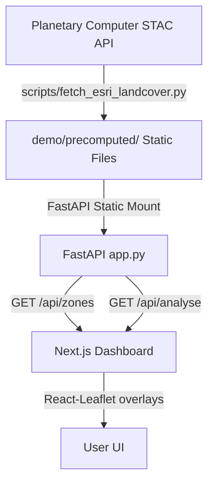
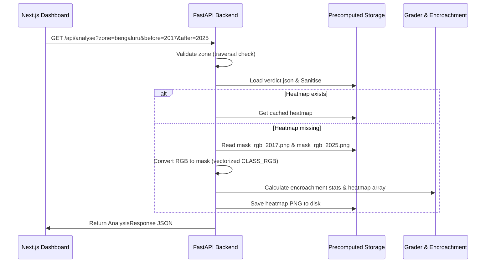

# Architecture Design — FarmGuard

This document details the system architecture, directory topology, and data flow of the FarmGuard/UrbanGenesis Farmland Encroachment Detection System.

---

## System Overview

FarmGuard is designed as a decoupled full-stack platform consisting of:
1. **Planetary Computer ETL Pipeline**: An ingestion engine that queries Sentinel-2 Level-2A imagery and ESRI Land Use / Land Cover (LULC) maps.
2. **FastAPI Backend Services**: A Python-based REST API that runs spatial analytics, serves region configuration, manages timeseries records, and caches dynamic heatmaps.
3. **Next.js 16 Dashboard**: An interactive, premium web client with React Leaflet map projections, comparative split-sliders, and data visualization timelines.

---

## Component Details

### 1. Ingestion Pipeline (`scripts/fetch_esri_landcover.py`)
- **Query Strategy**: Uses standard STAC API queries with multi-stage date fallbacks to retrieve cloud-free Sentinel-2 and ESRI LULC data for defined geographic bounding boxes.
- **Processing**: Aligns multi-band Sentinel-2 imagery (Red, Green, Blue, NIR) and crops/resamples LULC classification masks to native 10m spatial resolution.
- **Output**: Generates standardized PNGs (`true_color_YYYY.png`, `ndvi_map_YYYY.png`, `mask_rgb_YYYY.png`) and writes a `verdict.json` summary timeseries for the zone.

### 2. Analytical Engine (`analytics/`)
- **`abi.py`**: Computes the Agricultural Buffer Index (ABI) ratio:
  $$ABI = \frac{\text{Cropland} + \text{Dense Vegetation} + \text{Water Bodies}}{\text{Buildings}}$$
  If a zone has `0` buildings, the ABI caps at `99.99` to ensure JSON serialization compatibility and correct Grade A classification.
- **`change_detection.py`**: Builds transition matrices mapping land changes from a given `before` year to an `after` year.
- **`grader.py`**: Converts the ABI ratio into risk tiers (Grades A-F) and computes rapid encroachment warnings based on timeseries drop rates.

### 3. FastAPI Backend (`app.py`)
- **Endpoint `/api/zones`**: Reads and returns registered region metadata and latest metrics. Uses HTTP `Cache-Control: public, max-age=300` headers.
- **Endpoint `/api/analyse`**: Computes dynamic changes, transition percentages, and handles encroachment calculations.
- **Optimization & Safety**:
  - **Dynamic CORS**: Whitelist driven by the `CORS_ORIGINS` environment variable.
  - **Heatmap Caching**: Dynamic heatmaps are saved and indexed by the year-range. Repeat requests skip CPU rendering and disk writes.
  - **Vectorized Masking**: Module-level vectorized conversion of visualization RGB images back into class indices.
  - **Security**: Whitelist protection against directory traversal in file path resolution.

### 4. Next.js 16 Dashboard (`dashboard/`)
- **Interactive Map**: Uses Leaflet overlays to project RGB masks, True Color satellite bands, and NDVI indices. Supports comparative split-screen sliding.
- **Timeline Visualization**: Features custom SVG components (`LineChart` and `EncroachmentChart`) to render historical ratios and component trends.
- **Fault-Tolerance**: If the backend is offline, the client seamlessly falls back to pre-packaged historical timeseries data and prompts warnings if forecast years (2027–2051) are chosen.

---

## Data Flow for `/api/analyse`

